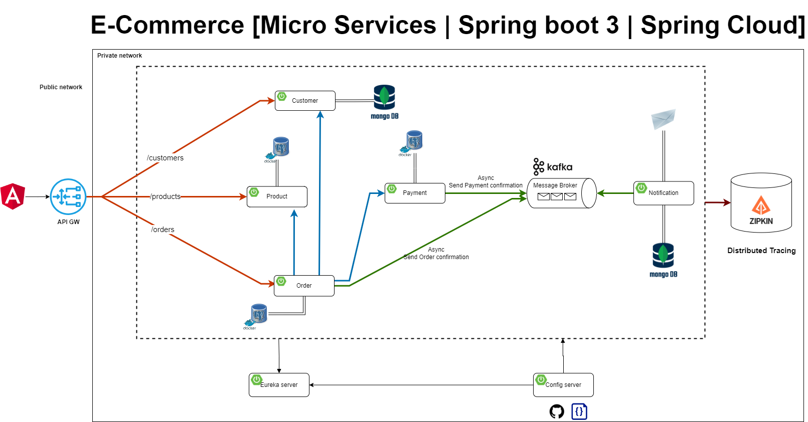

# E-Commerce Microservices Project

This repository contains an e-commerce application built using a microservices architecture with Spring Boot. The application is designed to handle customers, products, orders, payments, and notifications. The architecture ensures scalability, maintainability, and efficiency.

## Architecture Overview



### Components

1. **Frontend (Angular)**
   - The user interface of the application built with Angular. It interacts with the backend services through REST APIs.

2. **API Gateway**
   - Acts as a single entry point for all client requests.
   - Routes requests to the appropriate microservices.
   - Provides load balancing, security, and request filtering.

3. **Microservices**
   - **Customer Service**
     - Manages customer data.
     - Uses MongoDB for data storage.
   - **Product Service**
     - Manages product information.
     - Uses a PostgreSQL database for data storage.
   - **Order Service**
     - Handles customer orders.
     - Interacts with the Customer and Product services to manage order creation.
     - Uses a PostgreSQL database for data storage.
   - **Payment Service**
     - Manages payment processing.
     - Sends payment confirmation asynchronously to the Order service.
   - **Notification Service**
     - Sends notifications to customers.
     - Uses Kafka as a message broker for asynchronous communication.
     - Stores notification data in MongoDB.

4. **Message Broker (Kafka)**
   - Facilitates asynchronous communication between services.
   - Ensures that order and payment confirmations are processed reliably.

5. **Distributed Tracing (Zipkin)**
   - Provides distributed tracing to monitor and troubleshoot the flow of requests across microservices.

6. **Service Discovery (Eureka Server)**
   - Manages service registration and discovery.
   - Ensures that microservices can dynamically discover and communicate with each other.

7. **Configuration Server**
   - Centralized configuration management for all microservices.
   - Stores configuration files in a Git repository.

8. **Databases**
   - **MongoDB**: Used by Customer and Notification services for data storage.
   - **PostgreSQL**: Used by Product and Order services for data storage.

## How to Run the Project

1. **Clone the Repository**
   ```sh
   git clone https://github.com/seko17/ecommerce-springboot-microservice.git
   cd e-commerce-microservices

## How to Run the Project

### Start Docker Containers

1. Ensure Docker is installed and running on your machine.
2. Run the following command to start all required services using Docker Compose:
   ```sh
   docker-compose up -d

**Technologies Used**
- Spring Boot: Framework for building Java-based microservices.
- Angular: Frontend framework.
- Kafka: Message broker for asynchronous communication.
- Eureka: Service discovery.
- Zipkin: Distributed tracing.
- MongoDB: NoSQL database.
- PostgreSQL: Relational database.
- Docker: Containerization platform.
- Docker Compose: Tool for defining and running multi-container Docker applications


